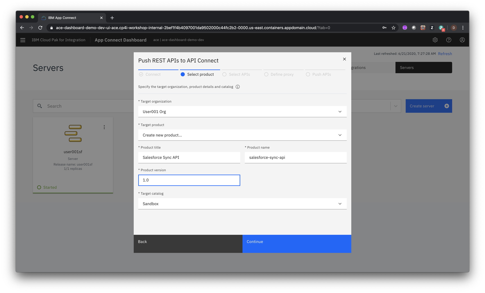
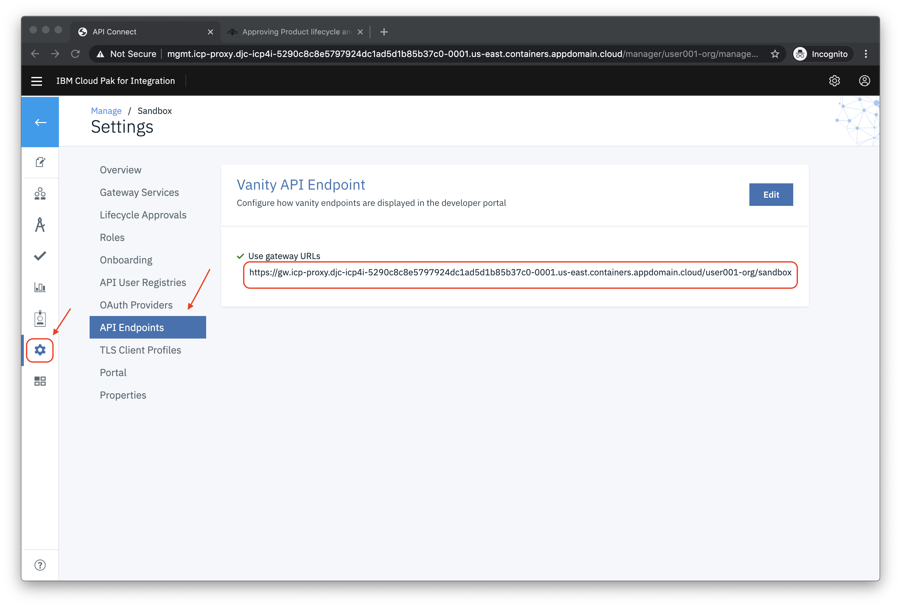

# Lab - Exploring the Tracing capability in IBM Cloud Pak for Integration

In this lab you will extend the App Connect Salesforce integration lab by managing the flow endpoint in API Connect. You will use the AppConnect Dashboard's  built support for pushing flow endpoints into API Connect directly . Once the changes are made you will redeploy the TraderLite app so that the Salesforce integration follows this path:

   *TraderLite app -> API Connect -> App Connect Flow -> Salesforce*

 You will then explore the tracing capability to examine a detailed trace of single application requests that span multiple capabilities.

The architecture of the  app is shown below:


The **portfolio** microservice invokes the REST endpoint of the new flow whenever a new client is created or read by the app and this results in a new contact being created in, or read from  Salesforce.

## Prerequisites

You must have successfully completed the lab *Sync Salesforce data using IBM App Connect Enterprise*

This lab is broken up into the following sections:

1. [Push Salesforce Flow API to APIConnect](#section-1-push-salesforce-flow-api-to-api-connect)

1. [Publish the Salesforce Flow API endpoint in API Connect ](#section-2-publish-the-salesforce-flow-api-endpoint-in-api-connect)

1. [Redeploy Trader Lite with the new Salesforce API Flow endpoint](#section-3-redeploy-trader-lite-with-the-new-salesforce-api-flow-endpoint)

1. [Look at traces](#section-4-look-at-the-traces)

1. [Summary](#summary)


## Section 1: Push Salesforce Flow API to API Connect

1.1 Bring up the App Connect Dashboard in a browser tab

   

1.2 On the tile for your deployed flow click on the 3 vertical dots and select **Share REST APIs ...** from the context menu

   

1.3 Select *IBM API Connect 2018* as the **API Connect Version**

1.4 Enter the following values in the remaining fields

  | Field name | Value |
  | :--------- | :---- |
  | Host | *Provided by instructor* |
  | Port | `443` |
  | Disable certificate verification when connecting | - [x] |
  | Username | *Your user??? username* |
  | Password | *Your user??? password* |
  | Realm | `provider/clouddragons-ldap` |
  | Client ID | `myclientid` |
  | Client secret | `myclientsecret` |

1.5 When you're done the dialog should look something like the following:

   

1.6 Click on **Connect to API Connect**

1.7 Select your organization from the dropdown list (should be the only one listed)

1.8 Enter the following values in the remaining fields

  | Field name | Value |
  | :--------- | :---- |
  | Target product | Create new product ... |
  | Product title | `Salesforce Sync API` |
  | Product version | `1.0` |
  | Target catalog | Sandbox |

1.9 When you're done the dialog should look something like the following:

   

1.10 Click **Continue** and then select the API flow you created in App Connect

   

1.11 Click **Continue** and then click **Push APIs**

   

1.12 Click **Done**


## Section 2: Publish the Salesforce Flow API endpoint in API Connect

In this section you'll publish the endpoint needed to access your Salesforce API in API Connect.

2.1 In a new browser tab open the API Connect Manager using the URL provided to you by your instructors.

2.2 Select the **Cloud Dragons LDAP** user repository if prompted and then login with your *user???* username and password

2.3 Click on the **Develop APIs and Products tile**

   

2.4 Click on the 3 horizontal dots next to the  API named *user???-0.0.1*  and select **Publish** from the context menu

   

2.5 Select **Existing Product** and then select the **Salesforce Sync API 1.0** product

   

2.6 Click **Next** and then select the **Sandbox** catalog

2.7 Click **Publish**

2.8 Next your'll get the endpoint for your published API. Click on the **Home** icon (top left) and then click on the **Manage Catalogs** tile.

  

2.9 Click on the **Sandbox** tile.

2.10 Click on the **Settings** icon and then on **API Endpoints**. Copy the gateway URL and put it in a text file

  

2.11 Append */user???sf* (ie the name of the  API flow) to the gateway URL in the text file where *user???* is your username. **Note:** For an API flow in App Connect the path of the URL starts with the name of the API flow.

  

## Section 3: Redeploy Trader Lite with the new Salesforce API Flow endpoint

3.1 From your IBM Cloud Shell terminal make sure you're still in the **trader-cp4i/scripts** folder

3.2 Run the following script with the URL you just copied to a text file and edited (ie API Connect gateway plus the top level path of your App Connect flow ):

```
./updateSalesforceIntegration.sh YOUR_FLOW_URL
```

3.3 The output should look like the following:

```
$ ./updateSalesforceIntegration.sh http://.../user001-org/sandbox/user001sf
Script being run from correct folder
Validating student id  ...
Verifying that Trader Lite is already installed ...
Found Trader Lite installed in this project
Updating Trader Lite with new  Salesforce Integration endpoint ...
traderlite.operators.clouddragons.com/traderlite patched
Restarting Portfolio microservice ...
Found  Portfolio pod traderlite-portfolio-546d45bf4f-nr42x. Restarting it ...
pod "traderlite-portfolio-546d45bf4f-nr42x" deleted
Salesforce Integration update completed successfully

Wait for all pods to be in the 'Ready' state before continuing
```
3.4 Wait for the Portfolio pod to restart. Run the following command.

```
oc get pods
```
  Repeat the command until all the pods are in the *Ready* state as shown below:
  ```
  NAME                                        READY   STATUS    RESTARTS   AGE
  traderlite-mariadb-0                        1/1     Running   0          6m21s
  traderlite-mongodb-6c79bf9554-swhvw         1/1     Running   0          6m21s
  traderlite-operator-6ddd5c4774-l5dcd        1/1     Running   0          19h
  traderlite-portfolio-546d45bf4f-86xqr       1/1     Running   0          3m55s
  traderlite-stock-quote-7965448598-dt7vw     1/1     Running   0          6m21s
  traderlite-trade-history-5648f749c4-v2w9j   1/1     Running   0          6m21s
  traderlite-tradr-6cd8d879f4-tznq7           1/1     Running   0          6m21s  
  ```

3.5 From the command line run the following script:

```
./showTradrUrl.sh
```

3.6 Copy the URL that is output and access it with your browser

3.7 Log in using the username `stock` and the password `trader`

3.8 Click on **Add Client**

  

3.9 Add a new  client  using valid formats for the Phone Number and email address. Click **Save**.

3.10 Click on the Portfolio ID of the added client

  

3.11 Click on **Client Details** and verify that the Salesforce Contact Id of the new client is shown.

  

3.12 Optional: Go to Salesforce and verify that a new contact was added with the details you provided.

## Section 4: Look at the traces

In the previous section you redeployed the Trader Lite app and then tested it using the following path:

   *TraderLite app -> API Connect -> App Connect Flow -> Salesforce*

Now you'll look at the resulting traces generated by the tracing capability.

4.1 In a new browser tab open the CP4I **Platform Home** URL provided to you by your instructors.

4.2 Login with your *user???* credentials

4.3 Click on **Skip Welcome**

4.4 Click on **View instances** and then click the link for Tracing

  


4.5 If prompted login with your *user???* credentials

4.6 Click on the **Traces** icon at the left

  

4.7 Besides the Trader Lite application activity, the API Connect trace includes a **webapi-init-check** every 10 seconds. Let's filter this out so it's easier to see the Trader Lite activity.

4.8 Click on **Add filter**

  

4.8 Scroll down and select the **Operation** field

  

4.10 Enter `/web` as the value and then select **/webapi-init-check** as the value

  

4.11 Click on the filter you just added and select **Invert** from the context menu

  

4.12 You should now see relevant traces from both API Connect and App Connect. Click on a trace that starts with your */user???* username in the **Root Operation** column and has both API Connect and App Connect in the **Capabilities** column. This represents a single operation that spanned both capabilities (i.e. calling the App Connect Flow via API Connect).

  

4.13 Note that the trace details are shown by level. Level 1 represents the entire time spent in the combined operations. The **Span** diagram shows how a subsequent level's time is included in the overall time. For example the screenshot below shows that `218.35ms` was spent overall in the combined operations and `188.48ms` of that overall time was spent in App Connect.

4.14 Hover over a span to see more details

  


## Summary

Congratulations ! You successfully completed the following key tasks in this lab:

* Pushed an App Connect Flow to API Connect directly from the App Connect Dashboard
* Redeployed the Trader Lite app to use the new API Connect endpoint for Salesforce integration
* Examined the available traces for the combined API Connect + App Connect flow
